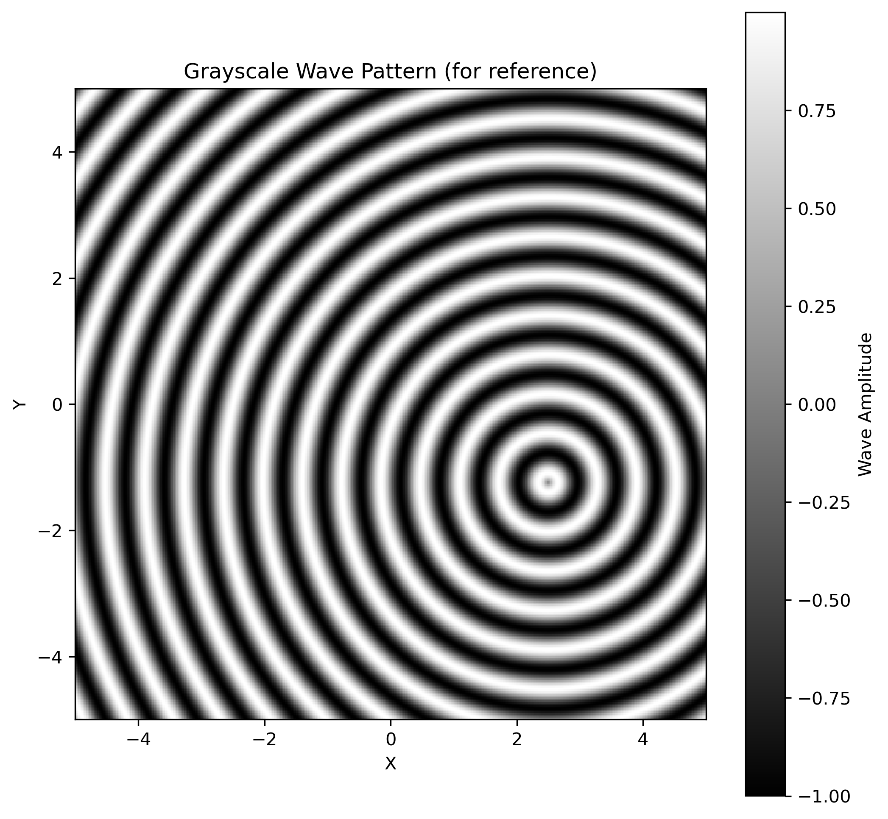

# Assignment 1: NumPy Array Manipulation for 2D Pattern Generation

[View on GitHub]({{ site.github.repository_url }})

---

## Pseudo-code
1. Define a two-dimensional coordinate grid over a specified spatial domain.
2. Specify an emission point and compute the radial distance from this point to every grid location.  
3. Apply a sinusoidal function to the radial distance field to generate concentric wave patterns.  
4. Normalize the resulting wave amplitudes to a consistent range.  
5. Map normalized wave values to RGB color channels to simulate depth and height variations.  
6. Combine the RGB channels into a single color image array.  
7. Visualize and export both color and grayscale representations of the pattern.  

---

## Technical explanation

### Overview of the Approach
This project generates a 2-dimensional wave pattern by applying a sinusoidal transformation to a radial distance field. A coordinate system is used to calculate the distance from an offset emission point to the any point in the grid. It produces concentric wavefronts that propagate outwards across the array from the emittance point. The resulting scalar field is then mapped to RGB color channels to enhance depth perception and visualize variations in wave amplitude.

### Coordinate Grid and Distance Field
The pattern generation begins by defining a two dimensional coordinate grid using evenly spaced values in both x and y direction. An emission point is specified with this grid, acting as the centre point of the wave pattern. For each grid location, the radial distance to the emission point is calculated. The distance field form the system of the pattern, as it lets the wave propagate uniformly in all directions rather than along a single axis.

### Sinusoidal Transformation and Parameters
To simulate wave behaviour, a sinusoidal function is applied to the distance field. It transforms the continously increase distance values into an evenly oscillating pattern of peaks and valleys, which results in concentric rings. The wavelength parameter controls the spatial frequency of the waves; smaller wavelengths results in densely packed ripples. And larger wavelengths result in fewer and more wide waverings. This parameters controls the visual density of the wave pattern.

### Normaliszation and RGB Mapping 
The sinusoidal transformation produces values in the range of −1 to 1, which are not directly suitable for color representation. These values are therefore normalized to a 0–1 range before visualization. The normalized values are mapped to RGB color channels, where higher amplitudes correspond to warmer colors and lower amplitudes correspond to cooler colors. This mapping encodes wave height as color, providing a more expressive visualization than grayscale alone.

### Visualisation and Outputs
The final RGB array is visualized as a full-color image, highlighting the spatial structure of the wave pattern. In addition, a grayscale version of the scalar wave field is generated for reference, making it easier to interpret the underlying amplitude values. Both images are exported and saved as part of the project documentation, ensuring consistency between the code output and the portfolio presentation.

### Parametric Behaviour and Design Intent
The behaviour of the pattern is highly sensitive to parameter changes. Adjusting the emission point shifts the origin of the wave and introduces asymmetry relative to the grid. Modifying the wavelength alters the spacing of the concentric rings, while changing the grid resolution affects the smoothness and level of detail in the output. These parameters demonstrate how simple mathematical relationships can generate a wide range of visual outcomes through computational design.

---

## Results 

---

## AI Acknowledgments

AI tools (ChatGPT) were used throughout the assignment for debugging, refactoring, and structuring the code and documentation. Prompting evolved from general troubleshooting toward targeted questions about specific algorithms, RhinoCommon usage, and Object-Oriented Programming structure.

During the development of this assignment, I used AI tools primarily as a technical assistant to help reason about geometry queries, agent behavior formulation, and Python/RhinoScriptSyntax implementation details. Below are examples of prompts used.