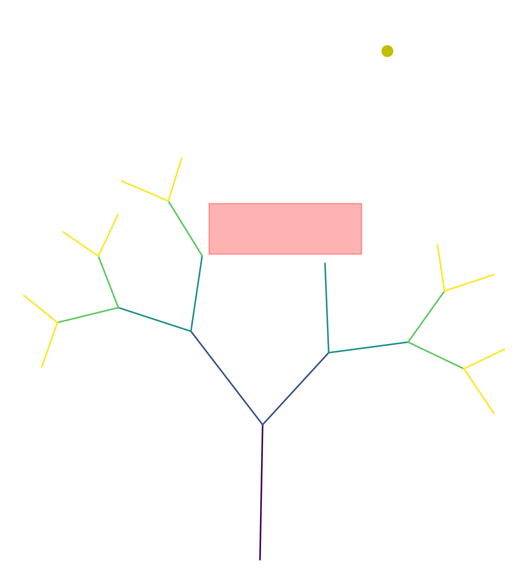

# Assignment 2: Exploring Fractals through Recursive Geometric Patterns

[View on GitHub]({{ site.github.repository_url }})


## Objective

In this assignment you will implement a **recursive generator** and enrich it with **geometric influences** that shape how the structure grows in space. You will work with geometric primitives (lines, polylines) using **Shapely** and render the results (e.g., with Matplotlib). The core of the assignment is to **couple formal grammar growth with spatial rules** such as attractor/repulsor points, fields, and collision constraints to produce expressive, controllable patterns.

While the branching or growth approach can be inspired by L-systems, it does not have to be strictly L-system based. You are encouraged to explore recursive generation methods influenced by spatial constraints and geometric rules that govern how the fractal develops and interacts with its environment. This opens opportunities to experiment with recursive branching logic, adaptive scaling, and spatial modulation beyond formal grammar rewriting.

---

## Repository structure

```
A2/
├── index.md                    # Do not edit front matter or content
├── README.md                   # Project documentation; Keep front matter, replace the rest with your project documentation
├── BRIEF.md                    # Assignment brief; Do not edit front matter or content
├── fractal_generator.py        # Your code implementation
└── images/                     # Add diagram, intermediary, and final images here
    ├── branching.png           # Assignment brief image; Do not delete
    └── ...
```
---

## Pseudo-code

1. Initialize global parameters controlling recursion depth, step length, branching angle, random seed, and spatial constraints.
2. Define an obstacle region as a bounding box and an attractor point in the growth domain.
3. Define a recursive growth function that:
   a. Terminates when the recursion depth reaches zero.
   b. Adjusts the current growth direction toward the attractor.
   c. Computes a new branch endpoint with randomized step length.
   d. Tests the proposed branch against obstacle constraints and prunes growth if an intersection occurs.
   e. Stores valid line segments.
   f. Recursively spawns two new branches with modified orientations and reduced step length.
4. Invoke the recursive growth function from an initial position and orientation.
5. Collect all generated line segments into a geometric structure.
6. Map visual attributes to recursion depth.
7. Render and export the resulting geometry as a clean image.

---

## Technical explanation

### Recursive Growth Logic

The fractal is generated using a direct recursive branching approach. The code begins from an initial position and orientation and repeatedly calls a recursive function that creates new line segments. At each recursive step, the function draws a branch, then spawns two child branches with modified headings and reduced step lengths. The recursion terminates when a predefined depth is reached, ensuring finite growth and structural control.

### Attractor Influence

An attractor point is introduced to influence branch orientation during growth. At each step, the current heading is adjusted slightly toward the attractor based on the angular difference between the branch direction and the attractor direction. This produces asymmetrical, curved growth patterns and demonstrates how external spatial fields can modulate recursive systems.

### Obstacle Constraint

Growth is constrained using an obstacle region defined as a rectangular bounding box. Before adding a new branch, the algorithm checks whether the proposed line segment intersects the obstacle. If an intersection occurs, the branch is pruned and recursion stops along that path. This introduces spatial awareness and prevents uncontrolled overlap, simulating environmental resistance.

### Controlled Randomness

Random variation is applied to step length and branching angle to increase visual complexity while maintaining reproducibility. A fixed random seed is used so that identical parameter sets always produce the same output. This allows systematic exploration of variations while preserving deterministic behavior.

### Visualization Mapping

Branch color is mapped to recursion depth using a continuous color map. Early branches appear darker, while later branches appear lighter, making the hierarchical structure of the recursion visually legible. This mapping encodes structural information rather than purely aesthetic variation.

---

## Results

### Generated Output

**Seed:** 28  
**Recursion Depth:** 5  
**Branch Angle:** 45°  
**Initial Step Length:** 6  
**Attractor Position:** (5, 20)  
**Obstacle Bounds:** (-2, 12, 4, 14)



The resulting image shows a branching structure that bends toward the attractor while avoiding the obstacle region. Branches terminate or redirect when encountering the constraint, clearly demonstrating the interaction between recursion and spatial modulation.

---

## Discussion

This project demonstrates how recursive growth systems can be meaningfully shaped using simple geometric rules. The combination of attractor steering and obstacle pruning allows the fractal to respond dynamically to its environment, producing controlled yet expressive forms. Small changes to parameters such as recursion depth, attractor strength, or obstacle placement result in significantly different outcomes, highlighting the sensitivity and flexibility of recursive design systems.

---

## Reproducibility

All outputs are reproducible using the recorded parameters and random seed. Changing the seed or spatial configuration allows systematic exploration of alternative growth patterns while preserving the underlying algorithmic structure.