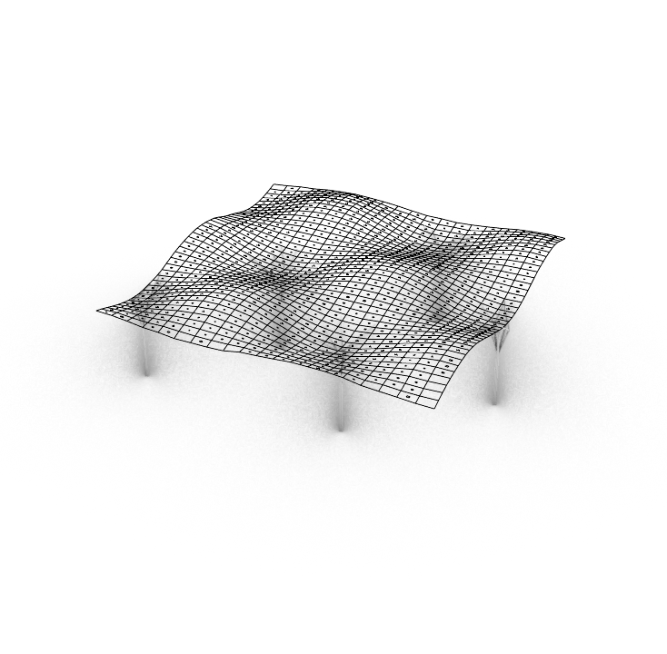
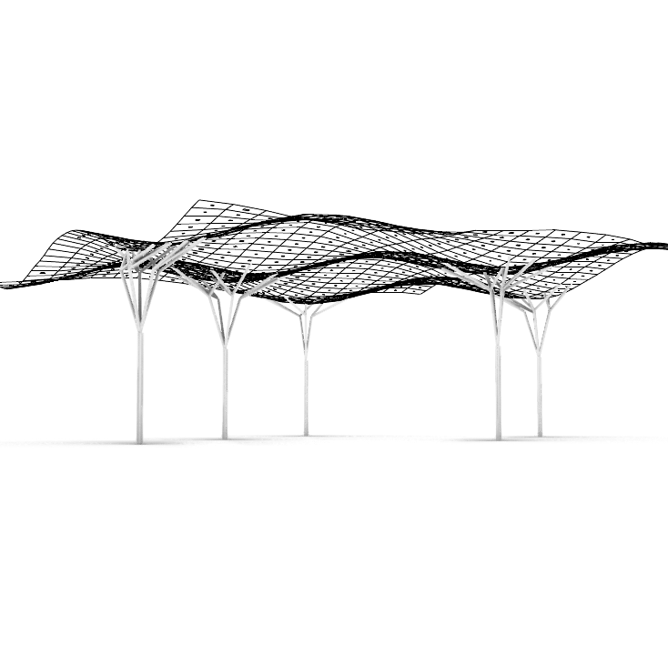
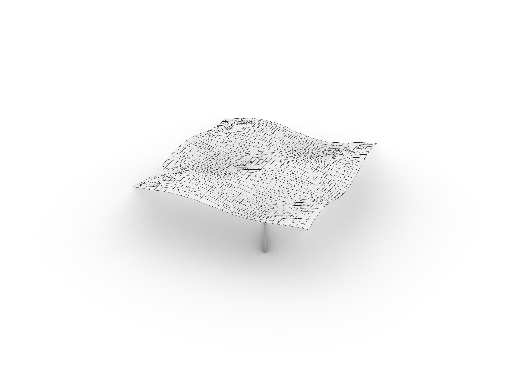
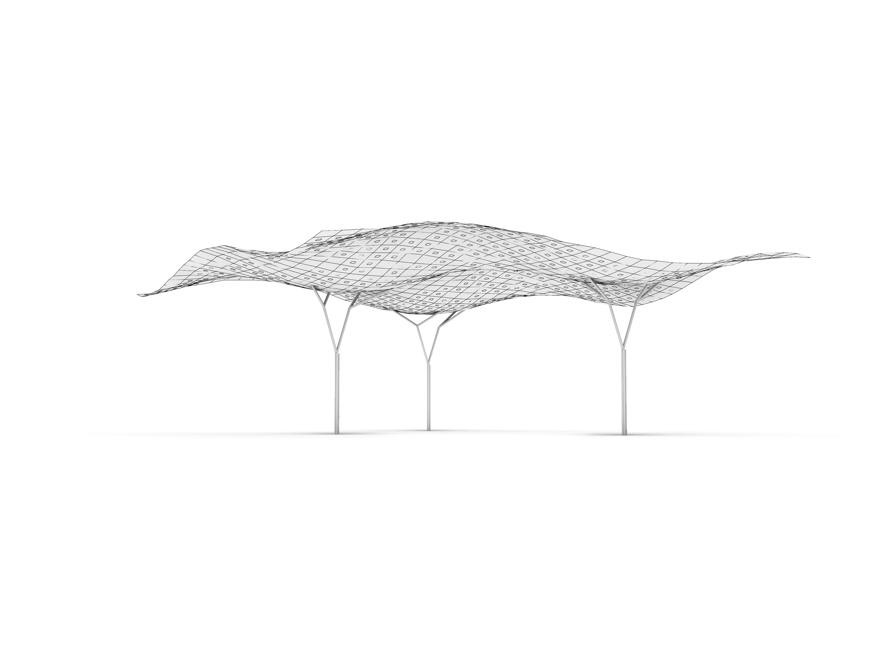
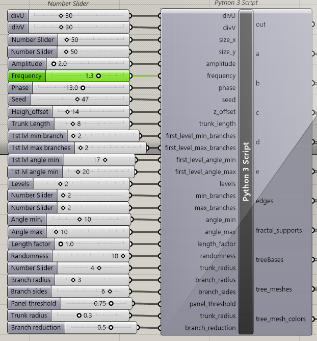
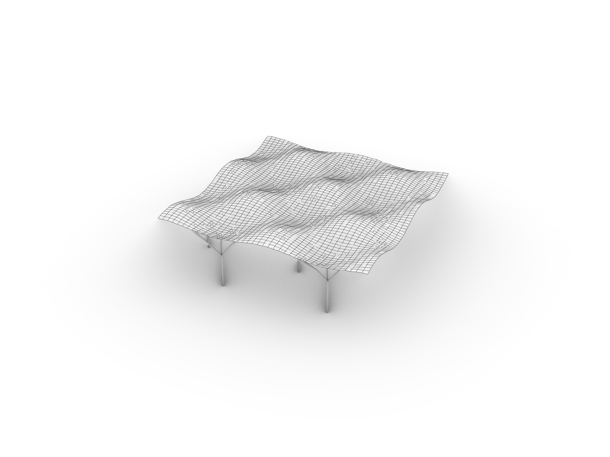
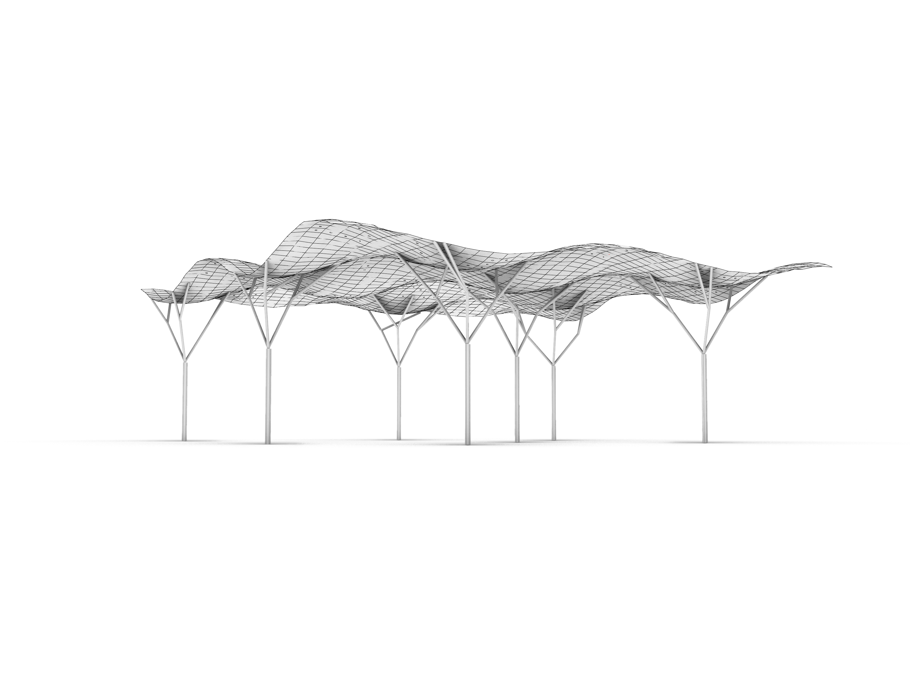
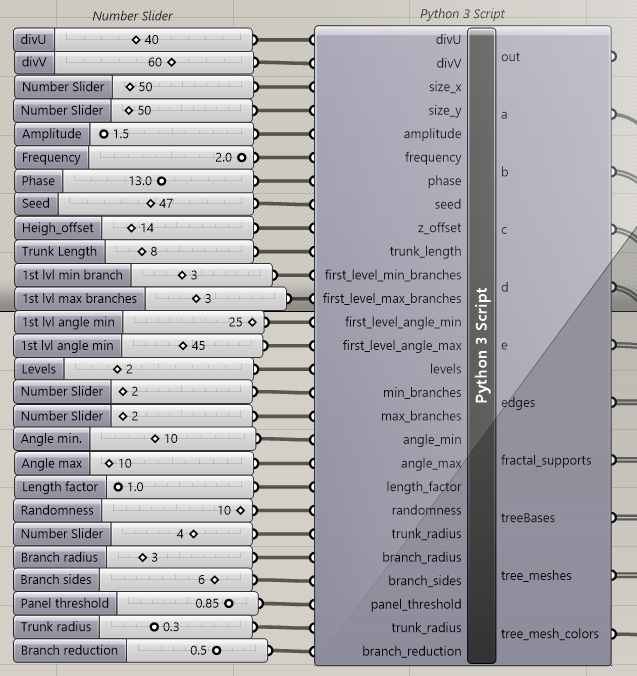

# Assignment 3: Parametric Structural Canopy

[View on GitHub]({{ site.github.repository_url }})


## Objective

In this assignment you will design and generate a **parametric structural canopy** in **Grasshopper** using the **GhPython (Python 3)** component. You will combine: (1) a **NumPy-driven heightmap** that modulates a NURBS surface, (2) **tessellation** of the resulting surface, and (3) **recursive, branching vertical supports** with controlled randomness. Your goal is to produce a small **family of design solutions** by varying parameters and algorithms, then communicate your process and results in a clear, reproducible report. You are asked to present **three** visually distinct designs. Each design must vary at least **two** of the implemented computational logic (heightmap-based surface geometry, tessellation strategy, branching supports).

---

## Repository Structure

```
A3/
├── index.md                    # Do not edit front matter or content
├── README.md                   # Project documentation; Keep front matter, replace the rest with your project documentation
├── BRIEF.md                    # Assignment brief; Do not edit front matter or content
├── parametric_canopy.py        # Your code implementation
├── parametric_canopy.gh        # Your grasshopper definition
└── images/                     # Add diagram, intermediary, and final images here
    ├── canopy.png              # Assignment brief image; Do not delete
    └── ...
```

---
# Pseducode
Below is steps explaning how the pseudocode is generated.


## 1. Set random seeds for reproducibility.
seed_everything(seed)

Have not worked this into everything though.

---

## 2. Build UV Grids — create uniform U,V samples for evaluation.

U, V = uv_grid(divU, divV)

Used the one from class, wish to rework into a voronoi pattern instead.

---

## 3. Compute Heightmap — produce a scalar field H over U,V that will drive displacement.
Heightmap is generated trough sine and cosine functions.

Input controlls in grasshopper offers posiblit to amplitude, frequency and phase with sliders.

This can vary the design.

---

## 4. Construct Canopy Surface — build a NURBS surface from the deformed point grid.
Similar to 2, used the one from class.


---
## 5. Tessellate into Panels — convert each cell of `Sgrid` into two 3‑point NURBS panels.
Used evaluate surface to calculate the slope at each panel and unitized the value.

This value was used to determine the size of a panel opening. 

This generates small to large openings on all quads.

Which openings to show can be controlled with an input controller for a threshold.

---
## 6. Choose Support Anchors — pick anchor points such as bounding‑box corners or custom points.
Used evaluate surface to calculate the lowest points of the surface.

Projected this point down with the same distance as the canopy was offset.

---
## 7. Generate Supports — grow a simple branching structure from the anchors using recursive rules.
From the point of anchors, a fractral tree was grown.

It is possible to control the first level seperately and then concurring combined.

It is possible to change,

Amount of levels.

Amount of branches in an interval.

Angle of branches in an interval.

Length of both trunk an branches.

Radius of trunk.

Radius of branches.

The last end of the tree searches for a point on the canopy, then the last branch from the tree generator is discarded and a new one is grown to the point on the canopy.

---
# Examples of variations of the canopy.
Below are some iterations of the canopy design.

## Version 1






## Version 2







## Version 3







---

# AI Aknowledgements

I have used AI extensively.

As I progressed in working with this assignment, I have been more thoughtfull on how to prompt.

My prompting have become more specific on what kind of tool I want to use for a specific task, 
more than what task I need assistance in completing.

Below are some examples of the most recent prompts.

1.
So I have some issues with the getting the lowest points from the surface. So I have several local minimaz, where I want the fractal trees to grow. However I just want one tree for each dip, but get several numbers at each local minima. I need to cull some points at each minima, so I only have one tree at each minima.
I expect it to be some kind of distance to nearby points.

2.
So I have the grid but I need to make some kind of panelisation. Each quad should have some kind of opening. The opening should be based on its placement along the surface. I want to analyze the surface curvature for the double derivative. If panel is on the ridge, it should it be the most open. If its in or close to a valley, it should be closed.

3.
This still generates small panel openings on valleys. I want to remove the smallest panels openings based on a cull function or something similar. The function should be controlled by an grasshopper input, which controls a threshold of the size of panels to be removed. The input should be placed in configuration part of my code.

4.
So with this panelisation. Each panel should be enumerated right. So both the initial quad and this secondary quad shares numbers?

5.
With every base_quad numbered and paired with K numbers for its slope, lets color the quads based on the their K value.

6.
I need to add some thickness to my trees and branches. The trunk should have one size, then each branch gets a reduction, that should be controllable. This control, one for the starting trunk size and one for the level of reduction of branches. should be an input, that can also be written in the configuration part of the code. I imagine the trunk size input is radius based and can be controlled with a slider. I imagine the reduction is a multiplyer input, in the range 0.5 to 0.95. I imagine the function using some kind of mesh piping for keeping it simple, yet fast for modelling several branches in an iterative design process. There should also be an option for coloring, so each division gets a new color.

# Additional

Besides prompts like above, ChatGPT have been used to specify how to order the script in a more meaning full way with sections, when I lost a bit of track of my code myself.

## Aknowledgements
For now I have used the UV grid generation from my class lecture, so I wish to aknowledge for Özgüç Bertug Çapunaman his work.