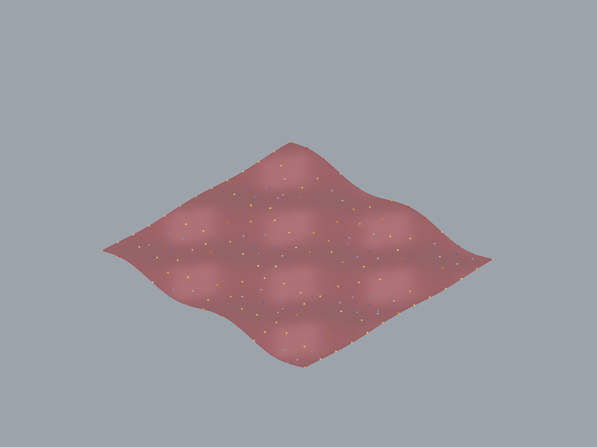

# Assignment 4: Agent-Based Modeling for Surface Panelization

[View on GitHub]({{ site.github.repository_url }})

---

## Pseudo-code Overview

The computational pipeline follows the steps below:

1. Initialize surface and parameters
The base surface is imported from Assignment 3 and converted into a single Brep face.
Surface parameter domains (U, V) are cached for normalized mapping.
Global parameters such as agent count, step size, edge threshold, and iteration count are defined.

2. Define Agent class (Object-Oriented structure)
An Agent class is defined to encapsulate state and behavior.
Each agent stores:

* Normalized UV position

* Reference to the surface face

* Surface parameter domains

3. Initialize agents on a regular UV grid
Agents are placed on a uniform grid in normalized UV space.
This ensures an even initial distribution before simulation begins.
Each agent position is mapped to a 3D point on the surface.

4. Map normalized UV positions to surface domain
Normalized UV coordinates are remapped to the actual surface domain intervals.
This ensures that agent positions correspond meaningfully to locations on the surface.

5. Sample surface slope (geometric signal)
At each agent position, local surface slope is approximated using finite differences.
Nearby surface points are sampled in U and V directions and height differences are computed.
The resulting slope vector is used as a directional signal.

6. Apply edge constraint (spatial signal)
Each agent computes its normalized distance to the surface boundaries.
If the distance falls below a threshold, the agent is frozen and no longer moves.
This prevents collapse or drift at surface edges.

7. Update agent positions
Free agents update their UV position by moving against the slope direction, simulating a rain-flow or valley-seeking behavior.
UV coordinates are clamped to remain within the valid domain.

8. Iterate simulation over time
The update step is repeated over multiple iterations using a Grasshopper Timer component.
Over time, agents migrate and cluster based on surface geometry.

9. Extract agent positions and trajectories
Final agent positions are collected as 3D points on the surface.
Optional debug geometry (slope vectors, trajectories) is generated for visualization and analysis.

10. Interpret agent distribution as panelization logic
Areas with higher agent density indicate regions of higher geometric demand.
These points can be used as input for triangulation or mesh-based panelization in Grasshopper.

---

## Technical Explanation

The system uses an agent-based modeling approach where agents act as geometric probes that continuously sample information from a surface and respond through local movement rules. Rather than explicitly defining panels, the model generates a spatial distribution of agents that can be interpreted as an adaptive panelization strategy.

Agents operate in a normalized UV domain, which allows consistent simulation independent of surface scale. At each step, agents query the surface geometry to compute local slope using finite differences. This slope acts as a geometric signal that drives motion, causing agents to migrate toward valleys and ridges where structural or geometric complexity is higher.

A second geometric signal is introduced through spatial boundary constraints. Agents near the surface edges are frozen to stabilize the simulation and prevent unwanted boundary accumulation. This constraint directly modulates agent behavior and affects the final spatial organization.

Over multiple iterations, the interaction between slope-driven motion and boundary constraints produces non-uniform agent densities across the surface. These densities can be interpreted as regions requiring finer or coarser panel resolution. The final agent positions can be triangulated or meshed in Grasshopper to produce a rationalized surface panelization.

All major parameters — agent count, step size, edge threshold, and simulation duration — are exposed as Grasshopper inputs, enabling controlled exploration of design variations.

---

## Examples of Design Variations

Multiple design outcomes were generated by adjusting simulation parameters while keeping the base surface constant.

| Parameter      | Variant A | Variant B | Variant C |
| -------------- | --------- | --------- | --------- |
| Agent count    | 170       | 100       | 170       |
| Step size      | 0.010     | 0.010     | 0.010     |
| Edge threshold | 0.04      | 0.04      | 0.04      |
| Iterations     | 15        | 15         | 1         |
| Min distance   | 0.08      | 1.2       | 0.8       |


Three design variants were generated by modifying agent count and movement parameters while keeping the surface and initialization logic constant.


### Variant A - 170 Agents

Baseline configuration with 170 agents.





### Variant B - 100 Agents

Reduced agent count (100), resulting in increased spacing and fewer local clusters.


### Variant C - 170 Agents

Increased step size, leading to faster convergence and tighter aggregation in high-slope regions.


## AI Acknowledgments

AI tools (ChatGPT) were used throughout the assignment for debugging, refactoring, and structuring the code and documentation. Prompting evolved from general troubleshooting toward targeted questions about specific algorithms, RhinoCommon usage, and Object-Oriented Programming structure.

During the development of this assignment, I used AI tools primarily as a technical assistant to help reason about geometry queries, agent behavior formulation, and Python/RhinoScriptSyntax implementation details. Below are examples of prompts used.

--- 

1. Slope Evaluation on a NURBS Surface
```
“I have agents moving in normalized UV space on a Rhino NURBS surface. How can I approximate the local slope direction at an agent’s position using finite differences in UV, so the agent can move toward valleys?”
```
This was used to derive a method for sampling nearby surface points and estimating slope vectors in UV space.

---

2. Mapping Normalized UV Coordinates to Surface Domain
```
“I store agent positions in normalized UV coordinates (0–1). How do I correctly remap these values to the actual surface domain in RhinoCommon so I can evaluate surface points and derivatives?”
```
This helped ensure that agent positions correspond meaningfully to locations on the surface geometry.

---

3. Clamping Agent Movement at Surface Edges
```
“I want agents to stop moving when they are close to the boundary of a surface. How can I compute the distance to the nearest UV edge and prevent movement if it is below a threshold?”
```
This prompt supported the implementation of edge-aware behavior and boundary constraints.

---

4. Agent-to-Agent Distance Checking (Separation Logic)
```
“Given a list of agents moving on a surface, how can I compute the minimum distance to nearby agents and use this to prevent agents from clustering too closely?”
```
This was used to reason about spacing and separation without implementing full boids-style cohesion or alignment.

---